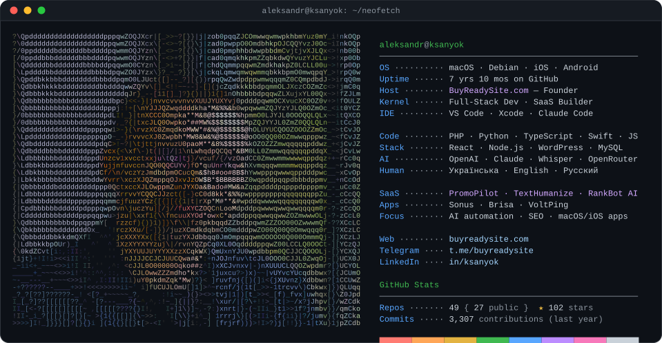

<!-- neofetch card: ASCII portrait generated from avatar by scripts/build_svg.py,
     stats auto-refreshed daily by .github/workflows/update-stats.yml -->
<picture>
  <source media="(prefers-color-scheme: dark)" srcset="neofetch-dark.svg">
  <source media="(prefers-color-scheme: light)" srcset="neofetch-light.svg">
  
</picture>

## ⚡ About Me

- 🏗 Founder of **[BuyReadySite.com](https://buyreadysite.com)** — ready-made digital products & web dev studio
- 🚀 Building **[PromoPilot](https://promopilot.link)** — AI link-building & promotion SaaS ([App Store](https://apps.apple.com/app/id6781813720) 📱)
- 🤖 Creator of **TextHumanize**  · **AI SEO Analyzer** 
- 🍎 Native macOS/iOS apps with Swift + AI — **Sonus**, **Brisa**, **PromoPilot iOS**
- 🌍 3,000+ GitHub contributions in the last year · Open source believer

 

## 🚀 Featured Projects

| Project | Description | Stack |
|---|---|:---:|
| [**PromoPilot**](https://promopilot.link) | AI promotion SaaS: cascades of publications, SEO audit, rank tracking · [iOS app](https://apps.apple.com/app/id6781813720) | PHP · Node.js · RN |
| [**TextHumanize**](https://github.com/ksanyok/TextHumanize) | AI text naturalization · 25 languages · 100% offline | Python · PHP · TS |
| [**AI SEO Analyzer**](https://github.com/ksanyok/AI-SEO-Content-Analyzer) | WordPress SEO plugin with OpenAI integration | PHP · WordPress |
| [**Sonus**](https://github.com/ksanyok/Sonus) | macOS app: record → transcribe → translate | Swift · Whisper · GPT |
| [**SMS SaaS Platform**](https://github.com/ksanyok/twilio-sms-platform) | Full SaaS: queues, realtime, billing, analytics | React · Node.js · MySQL |
| [**modx-to-astro**](https://github.com/ksanyok/modx-to-astro) | CMS migration CLI with zero-downtime deploy | Astro · Shell · CI/CD |
| [**VoltPing**](https://github.com/ksanyok/VoltPing) | Power monitoring · Telegram bot · Tuya Cloud | PHP · Python · SQLite |

 

## 🛠 Tech Stack

 

---

## 📦 Open Source Libraries

<table>
<tr>
<td align="center" width="50%">

### 🧠 [TextHumanize](https://github.com/ksanyok/TextHumanize)

AI text naturalization engine
**25 languages · 100% offline · zero deps**
PHANTOM™ & ASH™ detection bypass
Python · PHP · TypeScript · REST API · CLI

➡️ [texthumanize.link](https://texthumanize.link)

</td>
<td align="center" width="50%">

### ⚡ [HumanizeKit](https://github.com/ksanyok/HumanizeKit)

JavaScript humanizer toolkit
**Lightweight · Browser-ready · No deps**
Ports the TextHumanize engine to JS/TS
Ideal for frontend & Node.js integrations

➡️ [GitHub Repo](https://github.com/ksanyok/HumanizeKit)

</td>
</tr>
</table>

---

## 🧩 My SaaS Products

<table>
<tr>
<td align="center" width="50%">

### 🤖 PromoPilot

> AI-powered link-building & promotion platform

Cascades of AI-generated publications
SEO audit · Rank tracker · Crowd marketing
86 free SEO tools · Multi-language

**Built with:** PHP · Node.js · React Native · AI

</td>
<td align="center" width="50%">

### 🛒 BuyReadySite.com

> Ready-made digital products & web dev studio

Ready-to-launch websites & plugins.
WordPress · WooCommerce · SaaS MVPs
Custom development · AI integrations

**Telegram:** [@buyreadysite](https://t.me/buyreadysite)

</td>
</tr>
</table>

| Plugin | Stars | Description |
|--------|:-----:|-------------|
| [AI-SEO-Content-Analyzer](https://github.com/ksanyok/AI-SEO-Content-Analyzer) |  | Deep SEO analysis with OpenAI — for WordPress Classic/Block editors |
| [translatepress-addon-indexer](https://github.com/ksanyok/translatepress-addon-indexer) |  | Auto-indexes TranslatePress tables for search performance |
| [device-prices-acf-plugin](https://github.com/ksanyok/device-prices-acf-plugin) |  | ACF-powered pricing management for device service sites |
| [AutoTranslateContent](https://github.com/ksanyok/AutoTranslateContent) |  | Auto-translate WP content via Google Cloud Translation API |
| [acf-price-updater-plugin](https://github.com/ksanyok/acf-price-updater-plugin) |  | Bulk ACF price updater with import/export |
| [custom-device-page-generator-wp](https://github.com/ksanyok/custom-device-page-generator-wp) |  | Auto-generates device pages with ACF + multi-language |
| [wp-popup-product-info](https://github.com/ksanyok/wp-popup-product-info) |  | WooCommerce product info popup |
| [nowaway-woocommerce-shipping](https://github.com/ksanyok/nowaway-woocommerce-shipping) | — | Custom WooCommerce shipping method integration |
| [omega-woocommerce-importer](https://github.com/ksanyok/omega-woocommerce-importer) | — | Advanced product importer for WooCommerce |

---

## 🐍 Contribution Graph

<picture>
  <source media="(prefers-color-scheme: dark)" srcset="https://raw.githubusercontent.com/ksanyok/ksanyok/output/github-contribution-grid-snake-dark.svg">
  <source media="(prefers-color-scheme: light)" srcset="https://raw.githubusercontent.com/ksanyok/ksanyok/output/github-contribution-grid-snake.svg">
  
</picture>

 

## 📊 GitHub Stats

&nbsp;

 

&nbsp;

 

## 🏆 Trophies

 

## 🌐 Connect

---

© BuyReadySite.com · Building great software from Ukraine 🇺🇦

